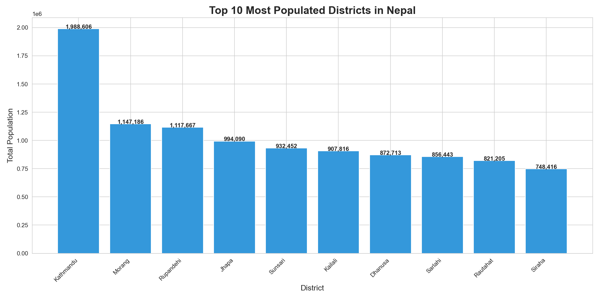
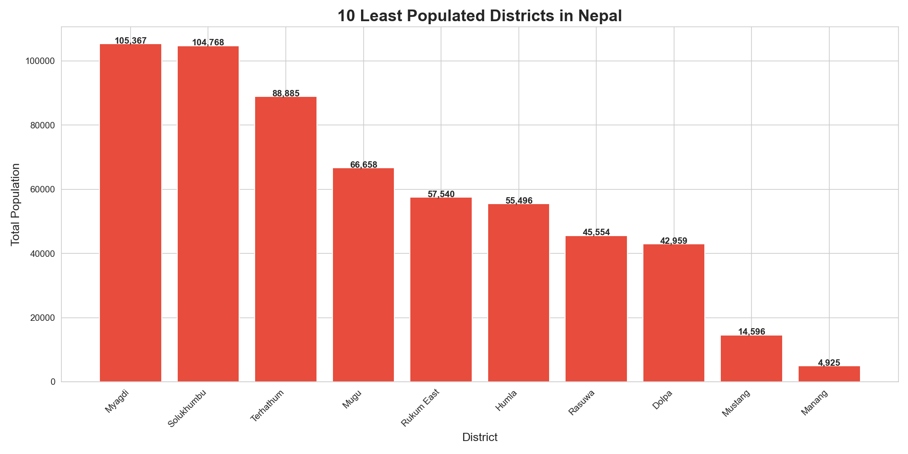
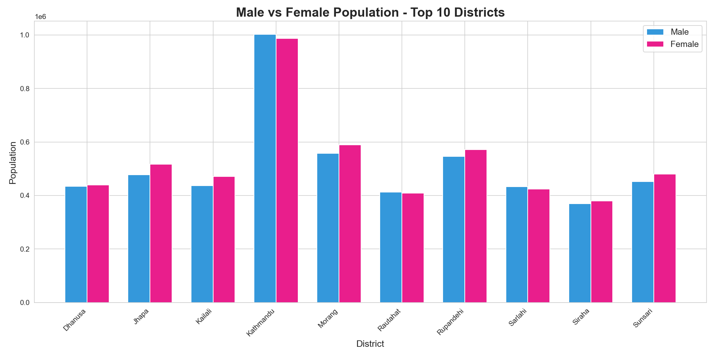
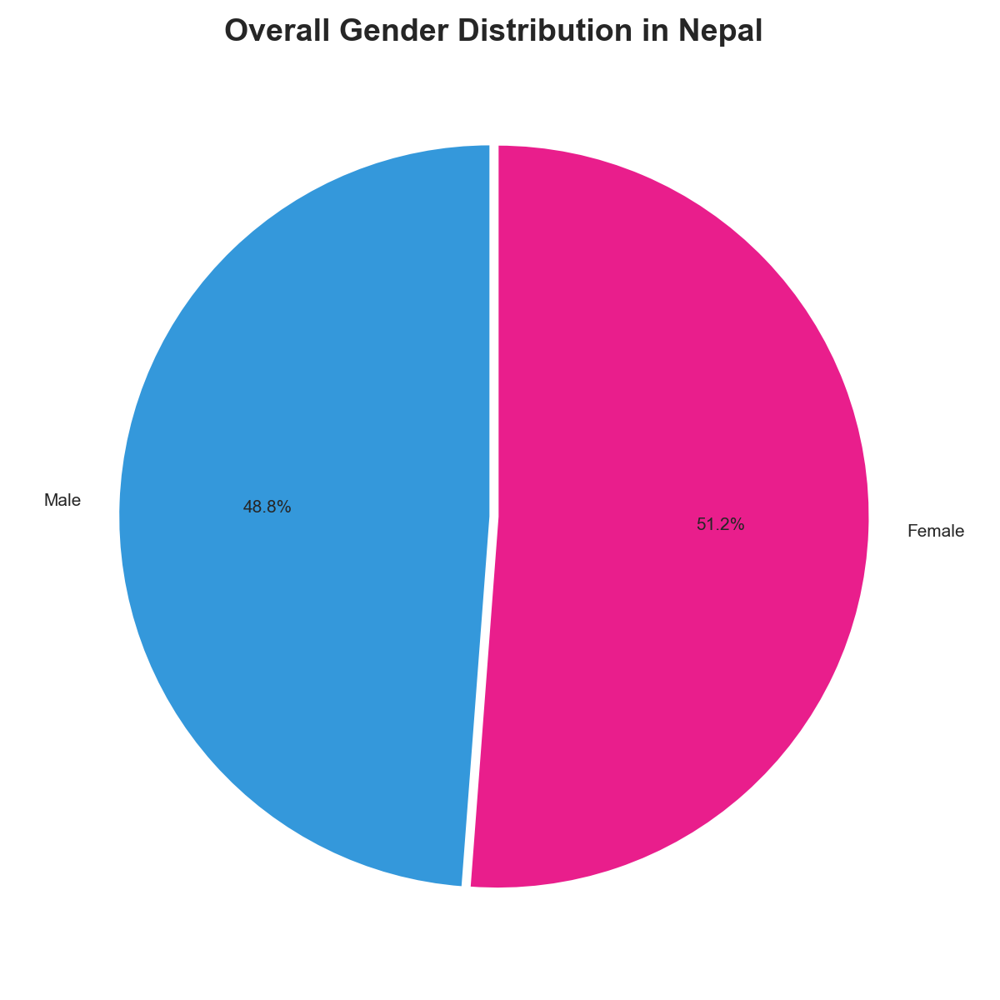
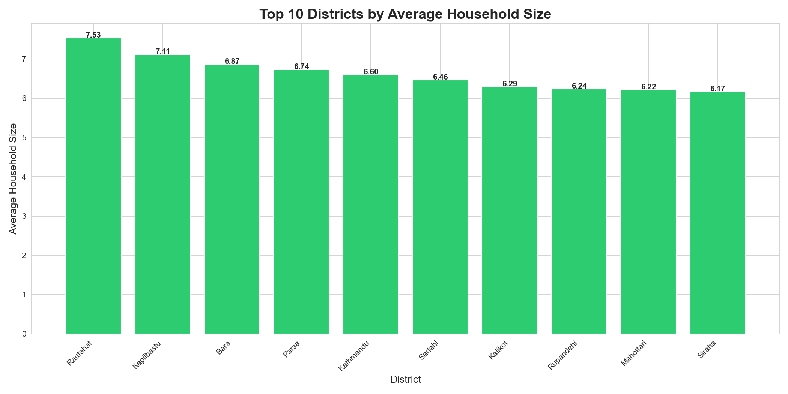

# Nepal Census Population Analysis 🇳🇵

## Overview
Python data analysis project on Nepal's official census data
to identify population trends, gender distribution, and
household patterns across all districts of Nepal.

## Dataset
- Source: Kaggle (Nepal Census Data)
- Coverage: All districts of Nepal
- Columns: District, Local Level, Total Population,
  Male, Female, Families, Households

## Tools Used
- Python, Pandas, Matplotlib, Seaborn
- Jupyter Notebook

## Visualizations

### Top 10 Most Populated Districts

### Least Populated Districts

### Male vs Female by District

### Overall Gender Distribution

### Average Household Size

## Key Insights
- Total Population of Nepal:     29,074,990
-  Total Male Population:         14,188,639
- Total Female Population:       14,886,351
- Gender Ratio (F per 100 M):    104.9
- Total Districts Analyzed:      77
- Most Populated District:       Kathmandu (1,988,606)
- Least Populated District:      Manang (4,925)
- Avg Household Size in Nepal:   5.15 people
